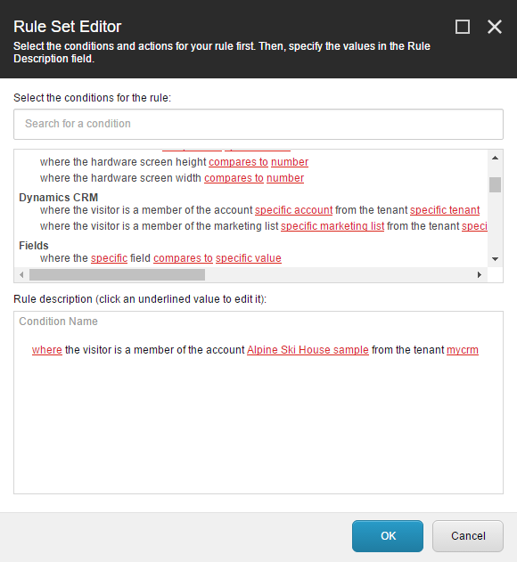

Personalization
=======================================

By adding a custom condition for the Sitecore Rules Editor you can allow 
content authors to personalize web pages using the visitor's account.

1.	In Visual Studio, add the following references to the project:
    
    * Sitecore.Analytics.dll

2.	Add the following class:

.. code-block:: c#

    using Examples.DynamicsCrm.Models;
    using Sitecore.Analytics.DynamicsCrm.Rules.Contacts.Conditions;
    using Sitecore.Analytics.Tracking;
    using Sitecore.Rules;
    using System;

    namespace Examples.DynamicsCrm.Rules
    {
        public class PersonalizationAccountCondition<T> : BaseMembershipCondition<T> where T : RuleContext
        {
            public PersonalizationAccountCondition() : base("AccountId")
            {
            }
            protected override bool DoesMatch(Guid entityId, Contact contact)
            {
                var facet = contact.GetFacet<ICrmContactDataEx>(this.ContactFacetName);
                if (facet == null)
                {
                    return false;
                }
                return facet.AccountId == entityId;
            }
        }
    }

3.	Compile the project.
4.	Deploy **Examples.DynamicsCrm.dll** to your Sitecore server.
5.	In Content Editor, navigate to **sitecore > system > Settings > Rules > Definitions > Elements > Dynamics CRM Visitor**.
6.	Add the following item:

    +--------------+----------------------------+
    | Template     | **Condition**              |
    +--------------+----------------------------+
    | Name         | **Dynamics CRM Account**   |
    +--------------+----------------------------+

7.	For the field **Text**, set the following value:

    **where the visitor is a member of the account [externalentityid,CRM Connect/DependentTree,dependency=tenant&mode=descendant&templateid={0DE319D9-125C-42F3-B330-05C30D1B42D3}&rootitemname=Accounts&selection=[ACCOUNT-TEMPLATE-ID]&setRootAsSearchRoot=true,specific account] from the tenant [tenant,Tree,root={5EE8330D-E35E-433B-9BA6-DAF87ED38867}&selection={327A381B-59F8-4E88-B331-BEBC7BD87E4E}&setRootAsSearchRoot=true,specific tenant]**

8.	In the field **Text**, change **[ACCOUNT-TEMPLATE-ID]** to the ID of the template created in :doc:`../simple-synchronization/add-templates-for-crm-entity-data`.
9.	Set the following field value:

    +--------------+----------------------------------------------------------------------------------------+
    | Field        | **Type**                                                                               |
    +--------------+----------------------------------------------------------------------------------------+
    | Value        | **Examples.DynamicsCrm.Rules.PersonalizationAccountCondition, Examples.DynamicsCrm**   |
    +--------------+----------------------------------------------------------------------------------------+

10.	Save the item.

Now you can configure a personalization condition based on whether or not the visitor is a member of a specific CRM account.
 

