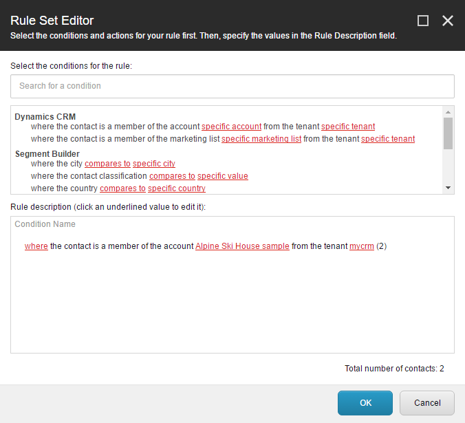

.. _custom-entity-data-segmentation:

Segmentation
=======================================

By adding a custom condition for the Sitecore Rules Editor, you can 
allow Sitecore List Manager users to use membership in a CRM account \
as a segmentation condition.

1.	In Visual Studio, add the following references to the project:
    
    * Sitecore.SegmentBuilder.dll

2.	Add the following class:

.. code-block:: c#

    using Sitecore.Analytics.DynamicsCrm.Rules.SegmentBuilder.Conditions;
    using Sitecore.Analytics.Rules.SegmentBuilder;
    using Sitecore.ContentSearch.Analytics.Models;
    using System;

    namespace Examples.DynamicsCrm.Rules
    {
        public class SegmentationAccountCondition<T> : BaseMembershipCondition<T> where T : VisitorRuleContext<IndexedContact>
        {
            public SegmentationAccountCondition() : base("AccountId", "crm.account")
            {
            }
        }
    }

3.	Compile the project.
4.	Deploy **Examples.DynamicsCrm.dll** to your Sitecore server.
5.	In Content Editor, navigate to **sitecore > system > Settings > Rules > Definitions > Elements > Dynamics CRM Segment Builder**.
6.	Add the following item:

    +--------------+----------------------------+
    | Template     | **Condition**              |
    +--------------+----------------------------+
    | Name         | **Dynamics CRM Account**   |
    +--------------+----------------------------+

7.	For the field **Text**, set the following value:

    **where the contact is a member of the account [externalentityid,CRM Connect/DependentTree,dependency=tenant&mode=descendant&templateid={0DE319D9-125C-42F3-B330-05C30D1B42D3}&rootitemname=Accounts&selection=[ACCOUNT-TEMPLATE-ID]&setRootAsSearchRoot=true,specific account] from the tenant [tenant,Tree,root={5EE8330D-E35E-433B-9BA6-DAF87ED38867}&selection={327A381B-59F8-4E88-B331-BEBC7BD87E4E}&setRootAsSearchRoot=true,specific tenant]**

8.	In the field **Text**, change **[ACCOUNT-TEMPLATE-ID]** to the ID of the template created in :ref:`add-templates-for-crm-entity-data`.
9.	Set the following field value:

    +--------------+----------------------------------------------------------------------------------------+
    | Field        | **Type**                                                                               |
    +--------------+----------------------------------------------------------------------------------------+
    | Value        | **Examples.DynamicsCrm.Rules.SegmentationAccountCondition, Examples.DynamicsCrm**      |
    +--------------+----------------------------------------------------------------------------------------+

10.	Save the item.

Now you can configure a segmentation condition based on whether or not the visitor is a member of a specific CRM account.
 
