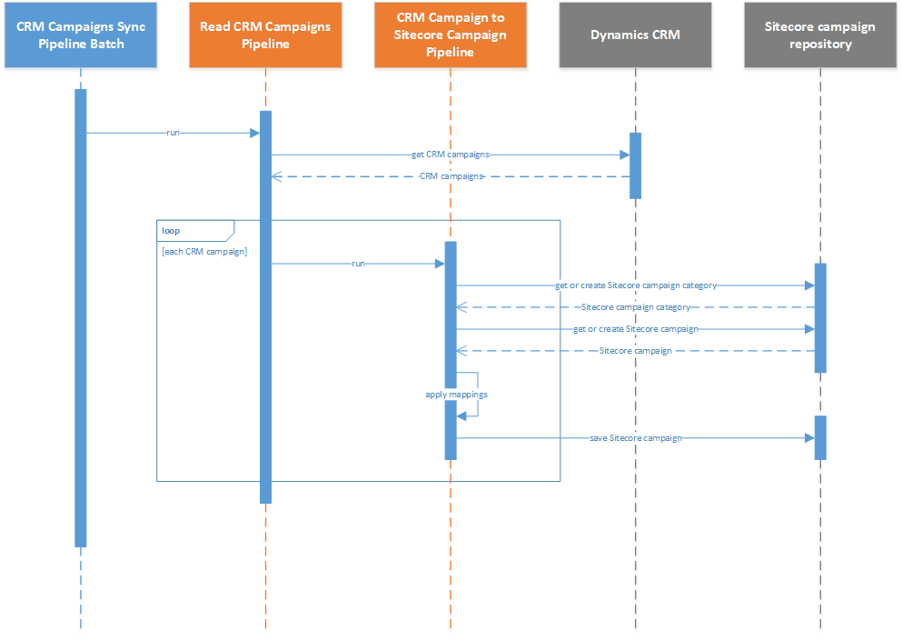

Overview
================

This synchronization process is defined in the *pipeline batch*
**CRM Campaigns Sync Pipeline Batch**.

The campaign synchronization process involves the following steps:

1. Read campaigns from CRM.
2. Loop through the campaigns from CRM. For each campaign:

   a) Get the Sitecore campaign that corresponds to the CRM campaign if one
      exists, otherwise create a new Sitecore campaign.
   b) Get the Sitecore *campaign category* that corresponds to the tenant if
      one exists, otherwise create a new Sitecore campaign category.
   c) Apply *value mappings* by reading values from the CRM campaign and
      writing those values to the Sitecore campaign.
   d) Save Sitecore campaign.

.. note::
  A more detailed sequence diagram is available
  :download:`here <_static/crm-campaigns-sequence-diagram-detailed.png>`.

.. caution::
  Campaigns are not automatically deployed. You must manually deploy
  campaigns before they can be used in Sitecore.
