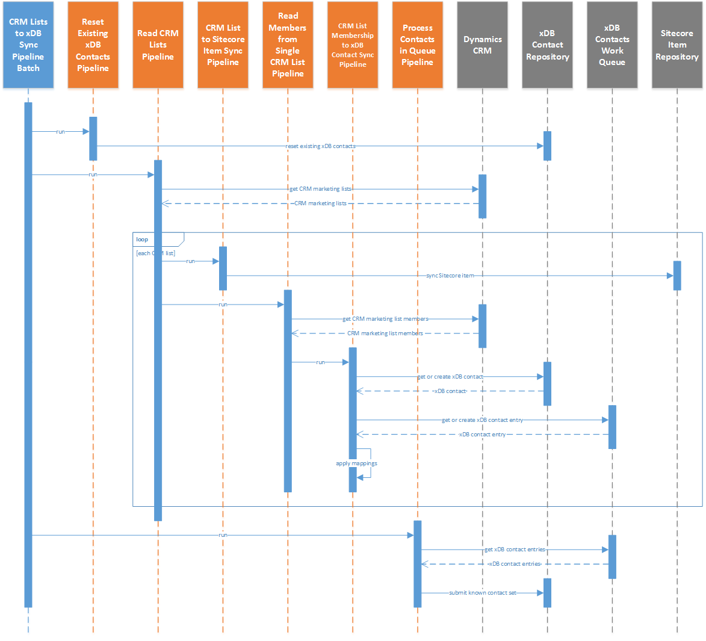

Overview
==========================

This synchronization process is defined in the *pipeline batch*
**CRM Lists to xDB Sync Pipeline Batch**.

The marketing list synchronization process involves the following steps:

#.	Reset marketing lists assigned to existing xDB contacts.

   .. note::
     For more information on why marketing lists are reset, see :ref:`about-rest-crm-marketinglist`.

2. Read marketing lists from CRM.
3. Loop through the marketing lists from CRM. For each marketing list:

   a)	Get the Sitecore item that corresponds to the CRM marketing list if one exists, otherwise create a new Sitecore item.
   b)	Apply value mappings by reading values from the CRM marketing list and writing those values to the Sitecore item.
   c)	Save the Sitecore item.
   d)	Read the marketing list members from CRM.
   e)	Loop through the marketing list members from CRM. For each marketing list member:

      #.	Get the xDB contact that corresponds to the CRM marketing list member if one exists, otherwise create a new xDB contact.
      #.	Get the contact entry from the work queue that corresponds to the xDB contact if one exists, otherwise create a new work queue entry.
      #.	Apply value mappings by reading values from the CRM marketing list member and writing those values to the work queue contact.

4.	Read contacts from work queue.
#.	Create a known contact set for the xDB bulk contact update API.
#.	Loop through the contacts from the work queue. For each contact:

   a) Add the contact to the known contact set.

6.	Submit the known contact set.

.. note::
  A more detailed sequence diagram is available
  :download:`here <_static/crm-lists-sequence-diagram-detailed.png>`.
