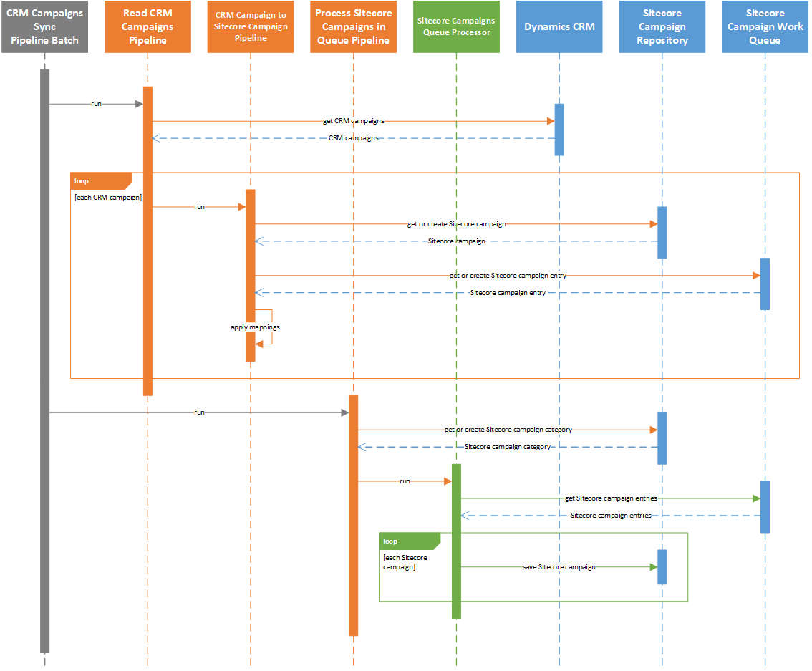

Overview
================

This synchronization process is defined in the *pipeline batch*
**CRM Campaigns Sync Pipeline Batch**.

The campaign synchronization process involves the following steps:

#. Read campaigns from CRM.
#. Loop through the campaigns from CRM. For each campaign:

   a) Get the Sitecore campaign that corresponds to the CRM campaign if one exists, otherwise create a new Sitecore campaign.
   b) Get the entry from the work queue that corresponds to the Sitecore campaign if one exists, otherwise create a new work queue entry.
   c) Apply value mappings by reading values from the CRM campaign and writing those values to the work queue entry.

3. Get the Sitecore campaign category that corresponds to the *tenant* if one exists, otherwise create a new Sitecore campaign category.
#. Read campaigns from work queue.
#. Loop through the campaigns from the work queue. For each campaign:

   a) Save the Sitecore campaign.

.. note::
  A larger version of this sequence diagram is available
  :download:`here <_static/crm-campaigns-sequence-diagram-simple.png>`.

.. caution::
  Campaigns are not automatically deployed. You must manually deploy
  campaigns before they can be used in Sitecore.
