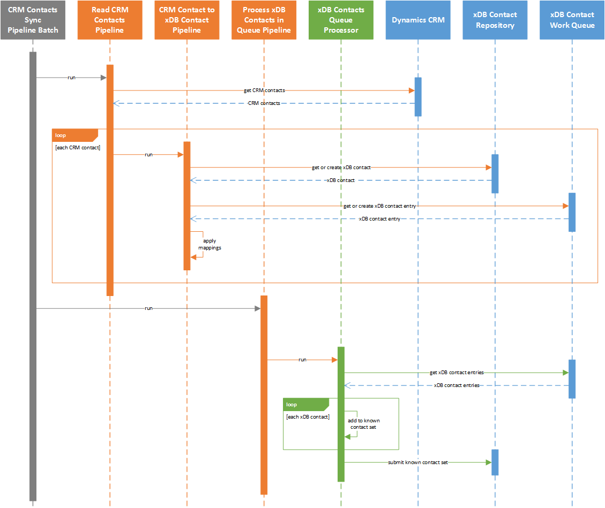

Overview
==========================

This synchronization process is defined in the *pipeline batch*
**CRM Contacts to xDB Sync Pipeline Batch**.

The contact synchronization process involves the following steps:

#. Read contacts from CRM.
#. Loop through the contacts from CRM. For each contact:

   a) Get the xDB contact that corresponds to the CRM contact if one exists, otherwise create a new xDB contact.
   b) Get the entry from the work queue that corresponds to the xDB contact if one exists, otherwise create a new work queue entry.
   c) Apply value mappings by reading values from the CRM contact and writing those values to the work queue entry.

3.	Read contacts from work queue.
#.	Create a known contact set for the xDB bulk contact update API.
#.	Loop through the contacts from the work queue. For each contact:

   a) Add the contact to the known contact set.

6.	Submit the known contact set.

.. note::
  A larger version of this sequence diagram is available
  :download:`here <_static/crm-contacts-sequence-diagram-simple.png>`.
