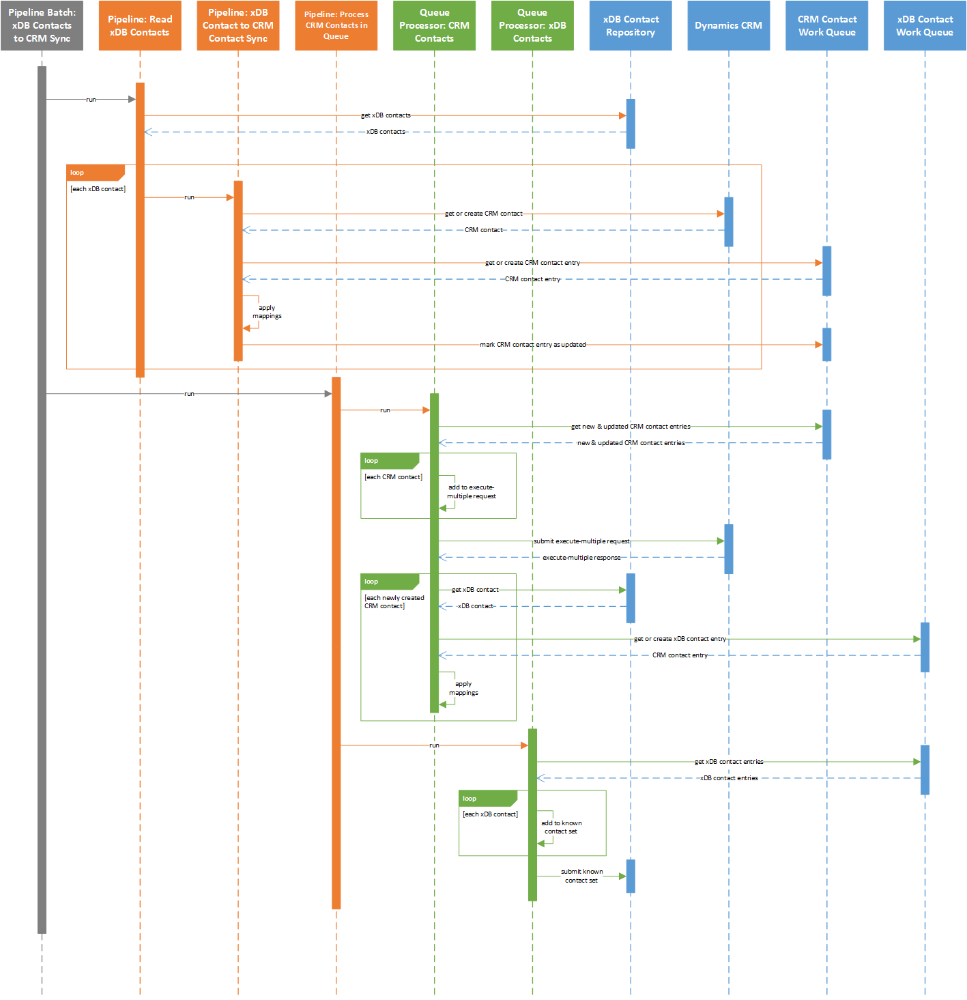

Overview
==========================

This synchronization process is defined in the *pipeline batch*
**xDB Contacts to CRM Sync Pipeline Batch**.

The contact synchronization process involves the following steps:

#.	Read contacts from xDB.
#.	Loop through the contacts from xDB. For each contact:

   a)	Get the CRM contact that corresponds to the xDB contact if one exists, otherwise create a new CRM contact.
   b) Apply value mappings by reading values from the xDB contact and writing those values to the work queue entry.

3. Read CRM contacts from work queue.
#. Loop through the contacts from the work queue. For each contact:

   a) Add the contact to a batch that can be submitted to CRM.

5. Submit the batch to CRM.
#. Loop through CRM contacts that were created. For each CRM contact:

   a) Get the xDB contact.
   b) Set the CRM contact id on the xDB contact. 

      .. note::
        Writing data back to the xDB contact is needed so that the CRM contact id is set on the xDB contact. This facilitates future synchronization.

.. note::
  A larger version of this sequence diagram is available
  :download:`here <_static/xdb-contacts-sequence-diagram-simple.png>`.
