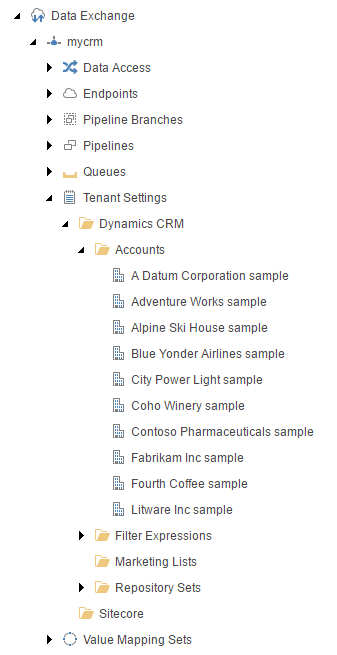

.. _run-pipeline-batch

Run Pipeline Batch
=====================================

If you run the *pipeline batch*, you should see the active CRM accounts
as children under your tenant, under **Tenant Settings > Dynamics CRM > Accounts**.

