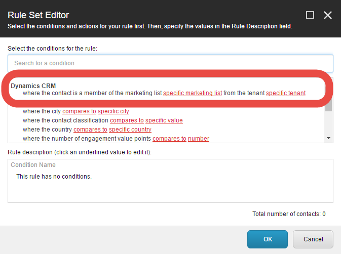

Segmentation
===================

Dynamics CRM Connect includes a condition for segmentation
that allows you to determine whether or not a visitor is a
member of a CRM marketing list.

When configuring a segmentation rule in List Manager,
you can find this condition under the section **Dynamics CRM**. 

.. hint:: 
    In order to configure this condition, you must first select your
    tenant. This is because the available marketing lists depends on
    the tenant you select.

.. attention::
    It is assumed you have synchronized CRM marketing lists. For 
    information on how to do this, see :doc:`/synchronization/index`.  
