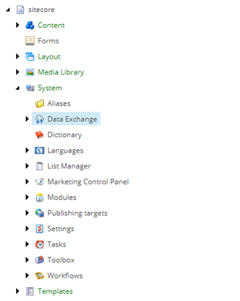
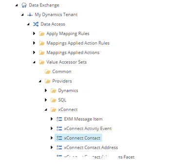
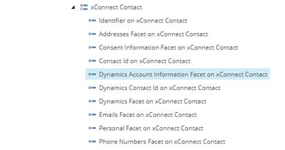
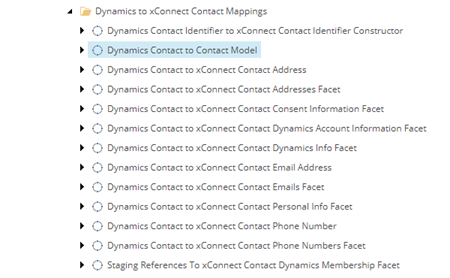
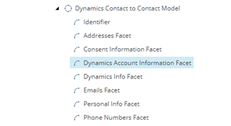

Map Contact Facet To Contact
===================================================

1. In Sitecore, open Content Editor.
2. Navigate to **sitecore > system > Data Exchange**

3. Select your tenant.

4. Navigate to **Data Access > Value Accessor Sets > Providers > xConnect > xConnect Contact**

5. Add the following item:

+---------------------------+---------------------------------------------------------------------+
| Template                  | **xConnect Entity Facet Value Accessor**                            |
+---------------------------+---------------------------------------------------------------------+
| Item name                 | **Dynamics Account Information Facet on xConnect Contact**          |
+---------------------------+---------------------------------------------------------------------+

6. Select the new item.

7. Set the following field values:

.. |field-value-for-facet-definition| replace:: **Collection Models > Custom Models > Custom Collection Model for Dynamics > Facets > Contact > DynamicsAccount**
.. |field-value-for-mapping-set| replace:: **Value Mapping Sets > Dynamics to xConnect Contact Mappings > Dynamics Contact to xConnect Contact Dynamics Account Information Facet**

+---------------------------+---------------------------------------------------------------------+
| Field                     | Value                                                               |
+===========================+=====================================================================+
| Facet Definition          | |field-value-for-facet-definition|                                  |
+---------------------------+---------------------------------------------------------------------+
| Mapping Set               | |field-value-for-mapping-set|                                       |
+---------------------------+---------------------------------------------------------------------+

8. Save the item.
9. Select your tenant.
10. Navigate to **Value Mapping Sets > Dynamics to xConnect Contact Mappings > Dynamics Contact to Contact Model**

11. Add the following item:

+---------------------------+---------------------------------------------------------------------+
| Template                  | **Value Mapping**                                                   |
+---------------------------+---------------------------------------------------------------------+
| Item name                 | **Dynamics Account Information Facet**                              |
+---------------------------+---------------------------------------------------------------------+

12. Select the new item.

13. Set the following field values:

.. |source-accessor-for-custom-facet-mapping| replace:: **Data Access > Value Accessors > Common > Value Accessor with Raw Value Reader Set**
.. |target-accessor-for-custom-facet-mapping| replace:: **Data Access > Value Accessor Sets > Providers > xConnect > xConnect Contact > Dynamics Account Information Facet on xConnect Contact**

+---------------------------+---------------------------------------------------------------------+
| Field                     | Value                                                               |
+===========================+=====================================================================+
| Source Accessor           | |source-accessor-for-custom-facet-mapping|                          |
+---------------------------+---------------------------------------------------------------------+
| Target Accessor           | |target-accessor-for-custom-facet-mapping|                          |
+---------------------------+---------------------------------------------------------------------+

14. Save the item.