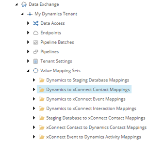
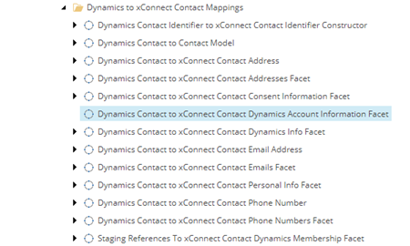

Map Dynamics Data To Contact Facet
===================================================

1. In Sitecore, open Content Editor.
2. Navigate to **sitecore > system > Data Exchange**

.. image:: _static/root-for-def.png

3. Select your tenant.

.. image:: _static/tenant.png

4. Navigate to **Value Mapping Sets > Dynamics to xConnect Contact Mappings**

5. Add the following item:

.. |item-name-for-value-mapping-set-for-custom-facet| replace:: **Dynamics Contact to xConnect Contact Dynamics Account Information Facet**

+---------------------------+---------------------------------------------------------------------+
| Template                  | **Value Mapping Set**                                               |
+---------------------------+---------------------------------------------------------------------+
| Item name                 | |item-name-for-value-mapping-set-for-custom-facet|                  |
+---------------------------+---------------------------------------------------------------------+

6. Select the new item.

7. Add the following item:

+---------------------------+---------------------------------------------------------------------+
| Template                  | **Value Mapping**                                                   |
+---------------------------+---------------------------------------------------------------------+
| Item name                 | **Account Name**                                                    |
+---------------------------+---------------------------------------------------------------------+

8. Select the new item.

9. Set the following field values:

.. |source-accessor-for-account-name-mapping| replace:: **Data Access > Value Accessor Sets > Providers > Dynamics > Dynamics Contact > Account on Dynamics Contact**
.. |target-accessor-for-account-name-mapping| replace:: **Data Access > Value Accessor Sets > Providers > xConnect > xConnect Contact Dynamics Account Information Facet > Account Name on Dynamics Account Information Facet on xConnect Contact**

+---------------------------+---------------------------------------------------------------------+
| Field                     | Value                                                               |
+===========================+=====================================================================+
| Source Accessor           | |source-accessor-for-account-name-mapping|                          |
+---------------------------+---------------------------------------------------------------------+
| Target Accessor           | |target-accessor-for-account-name-mapping|                          |
+---------------------------+---------------------------------------------------------------------+

10. Save the item.