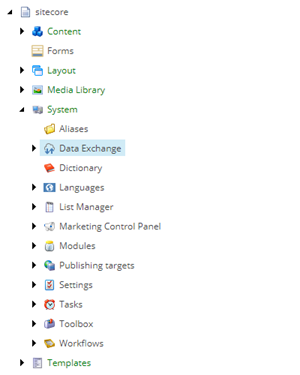

Register Collection Model
===================================================
You must register your custom collection model before
it can be used. This involves updating the components 
and configuration on several Sitecore server roles.

.. contents:: In this topic:
   :local:

Deploy Custom Components
---------------------------------------------------
The assembly that contains the custom contact facet
and collection model must be deployed on your Sitecore
server.

1. Build the Visual Studio project.
2. Copy **Examples.Connect.Dynamics.dll** to your Sitecore server.

Add Collection Model Definition
---------------------------------------------------
The collection model must be defined within Sitecore. 

.. note::

    A custom data provider exposes the facets defined in 
    the collection model. This makes it easier to configure
    data mapping that involves xConnect entities by showing
    the user what is available and reducing the changes that
    the user will accidentally enter an invalid value.

1. In Sitecore, open Content Editor.
2. Navigate to **sitecore > system > Settings > Data Exchange > Providers > xConnect > Collection Models**

3. Add the following item:

+---------------------------+---------------------------------------------------------------------+
| Template                  | **Collection Model Folder**                                         |
+---------------------------+---------------------------------------------------------------------+
| Item name                 | **Custom Models**                                                   |
+---------------------------+---------------------------------------------------------------------+

4. Select the new item.

5. Add the following item:

+---------------------------+---------------------------------------------------------------------+
| Template                  | **Compiled Collection Model**                                       |
+---------------------------+---------------------------------------------------------------------+
| Item name                 | **Custom Collection Model for Dynamics**                            |
+---------------------------+---------------------------------------------------------------------+

6. Select the new item.

7. Set the following field values:

.. |model-type| replace:: ``Examples.Connect.Dynamics.DynamicsConnectCollectionModelEx, Examples.Connect.Dynamics``

+---------------------------+---------------------------------------------------------------------+
| Field                     | Value                                                               |
+===========================+=====================================================================+
| Collection Model Type     | |model-type|                                                        |
+---------------------------+---------------------------------------------------------------------+

8. Save the item.

Deploy Collection Model
---------------------------------------------------
The collection model must be deployed to the xConnect 
before any custom data can be sent to xConnect. This
is accomplished by copying a JSON file that describes
the collection model.

1. In the ribbon, click **Covert Model to JSON**.

2. Save the model file.
3. Deploy the model file to the following servers:

    a. xConnect collection
    b. xConnect indexing

Configure xConnect Client Endpoint
---------------------------------------------------
In order to make a connection to xConnect a collection
model must be specified. This ensures xConnect and the
xConnect client know exactly what to expect from one
another.

1. Navigate to **sitecore > system > Data Exchange**

2. Select your tenant.

.. image:: _static/tenant.png

3. Navigate to **Endpoints > Providers > xConnect > xConnect Client Endpoint**

4. Set the following field values:

.. |collection-model| replace:: **Collection Models > Custom Models > Custom Collection Model for Dynamics**

+---------------------------+---------------------------------------------------------------------+
| Field                     | Value                                                               |
+===========================+=====================================================================+
| Collection Model          | |collection-model|                                                  |
+---------------------------+---------------------------------------------------------------------+

5. Save the item.

Test The Configuration
---------------------------------------------------
Testing the configuration ensures that the collection 
model is deployed and the xConnect client endpoint is
configured properly.

1. In the ribbon, click **Run Troubleshooter**.

2. A message will appear, informing you a connection to the xConnect collection service was established.

