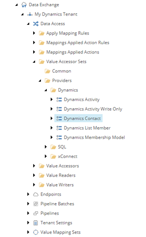
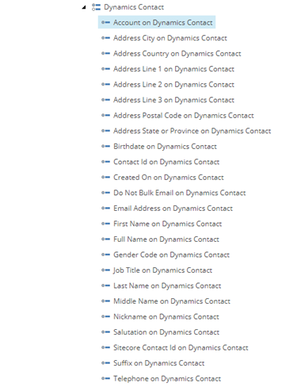

Specify How To Read From The Dynamics Contact
===================================================
The tenant must be configured to understand the structure
of the data being read from Dynamics. This section 
describes how to update the tenant in order to incorporate
this information.

.. contents:: In this topic:
   :local:

Add Value Accessor For Account On Contact
---------------------------------------------------
A value accessor is used to represent that the account
is a property of the contact in Dynamics. This value
accessor serves a couple of purposes:

    * When you read contacts from Dynamics, you must
      tell Dynamics to include the account for the
      contact. The value accessors in the value accessor
      set are used to determine which fields on the 
      contact object should be read. Adding a value
      accessor enables you to specify that you want
      to read additional fields from Dynamics.
    * When it is time to configure the mapping of data
      from Dynamics to Sitecore, the value accessor
      is used to specify which value to read from the
      Dynamics contact.
    
1. In Sitecore, open Content Editor.
2. Navigate to **sitecore > system > Data Exchange**

.. image:: _static/root-for-def.png

3. Select your tenant.

.. image:: _static/tenant.png

4. Navigate to **Data Access > Value Accessor Sets > Providers > Dynamics > Dynamics Contact**

5. Add the following item:

+---------------------------+---------------------------------------------------------------------+
| Template                  | **Entity Attribute Value Accessor**                                 |
+---------------------------+---------------------------------------------------------------------+
| Item name                 | **Account on Dynamics Contact**                                     |
+---------------------------+---------------------------------------------------------------------+

6. Select the new item.

7. Set the following field values:

+---------------------------+---------------------------------------------------------------------+
| Field                     | Value                                                               |
+===========================+=====================================================================+
| Attribute Name            | ``parentcustomerid``                                                |
+---------------------------+---------------------------------------------------------------------+
| Value Type                | ``Formatted Value``                                                 |
+---------------------------+---------------------------------------------------------------------+

8. Save the item.
