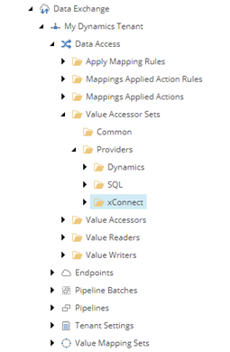
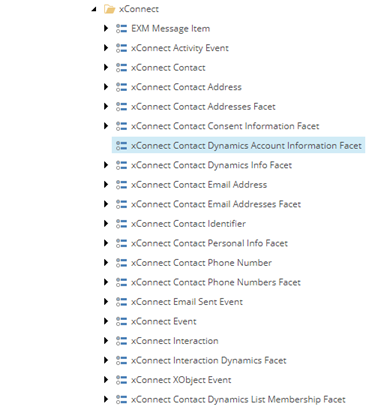

Specify How To Write To The Contact Facet
===================================================

1. In Sitecore, open Content Editor.
2. Navigate to **sitecore > system > Data Exchange**

.. image:: _static/root-for-def.png

3. Select your tenant.

.. image:: _static/tenant.png

4. Navigate to **Data Access > Value Accessor Sets > Providers > xConnect**

5. Add the following item:

+---------------------------+---------------------------------------------------------------------+
| Template                  | **xConnect Entity Facet Value Accessor Set**                        |
+---------------------------+---------------------------------------------------------------------+
| Item name                 | **xConnect Contact Dynamics Account Information Facet**             |
+---------------------------+---------------------------------------------------------------------+

6. Select the new item.

7. Add the following item:

.. |item-name-for-account-name-value-accessor| replace:: **Account Name on Dynamics Account Information Facet on xConnect Contact**

+---------------------------+---------------------------------------------------------------------+
| Template                  | **xConnect Entity Facet Property Value Accessor**                   |
+---------------------------+---------------------------------------------------------------------+
| Item name                 | |item-name-for-account-name-value-accessor|                         |
+---------------------------+---------------------------------------------------------------------+

8. Select the new item.

9. Set the following field values:

.. |facet-property| replace:: ``Collection Models/Custom Models/Custom Collection Model for Dynamics/Facets/Contact/DynamicsAccount/AccountName``

+---------------------------+---------------------------------------------------------------------+
| Field                     | Value                                                               |
+===========================+=====================================================================+
| Facet Property            | |facet-property|                                                    |
+---------------------------+---------------------------------------------------------------------+

10. Save the item.