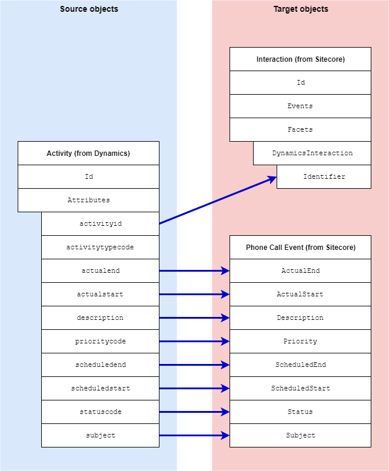

Phone Call Event
===================================================
This section describes how phone call activities from Dynamics 
are mapped to events in Sitecore.

.. contents:: In this topic:
   :local:

Format in Dynamics
-------------------------------------------------
In Dynamics, a contact can be associated with multiple
phone call activities. Each activity is a separate entity
that is linked to the contact.

.. note::

    Only completed activities are read from Dynamics.

Format in Sitecore
-------------------------------------------------
In Sitecore, phone call activity details are stored in
an event. The event is associated with an interaction.

The following interaction facet is used to identify
that the interaction came from Dynamics:

.. |dynamics-activity-facet-type| replace:: ``Sitecore.DataExchange.Tools.DynamicsConnect.Facets.DynamicsActivityInteraction``

+---------------------------+-------------------------------------------------+
| Facet Name                | ``DynamicsInteraction``                         |
+---------------------------+-------------------------------------------------+
| Facet Type                | |dynamics-activity-facet-type|                  |
+---------------------------+-------------------------------------------------+

The following event type is used to store phone call activity details:

.. |dynamics-call-event-type| replace:: ``Sitecore.DataExchange.Tools.DynamicsConnect.Events.PhoneCallEvent``

+---------------------------+-------------------------------------------------+
| Event Type                | |dynamics-call-event-type|                      |
+---------------------------+-------------------------------------------------+

Mapping Values
-------------------------------------------------
Separate mappings are needed for the interaction facet and the event.

.. |dynamics-call-interaction-mapping-location| replace:: **Dynamics to xConnect Interaction Mappings > Dynamics Activity to xConnect Dynamics Interaction Facet**
.. |dynamics-call-event-mapping-location| replace:: **Dynamics to xConnect Event Mappings > Dynamics Activity to xConnect Event**

+---------------------------+--------------------+-------------------------------------------------+
| Source objects            | interaction facet, | Activity entity from Dynamics                   |
|                           | event              |                                                 |
+---------------------------+--------------------+-------------------------------------------------+
| Target object             | interaction facet  | |dynamics-activity-facet-type|                  |
+---------------------------+--------------------+-------------------------------------------------+
| Mapping definition        | interaction facet  | |dynamics-call-interaction-mapping-location|    |
+---------------------------+--------------------+-------------------------------------------------+
| Target object             | event              | |dynamics-call-event-type|                      |
+---------------------------+--------------------+-------------------------------------------------+
| Mapping definition        | event              | |dynamics-call-event-mapping-location|          |
+---------------------------+--------------------+-------------------------------------------------+

