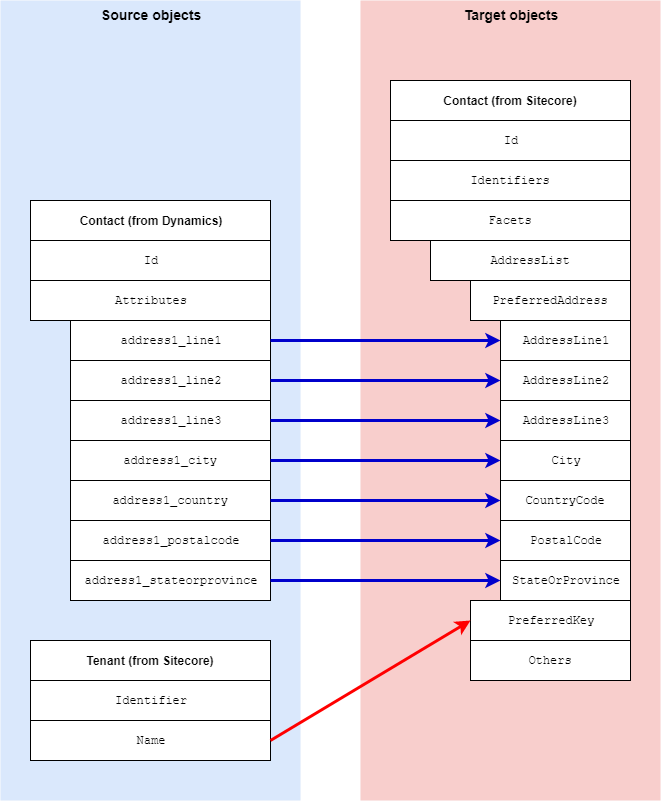

Addresses Facet
=================================================
This section describes how postal address information is
mapped from a contact in Dynamics to a contact in Sitecore.

.. contents:: In this topic:
   :local:

Format in Dynamics
-------------------------------------------------
In Dynamics, addresses are associated with a contact 
through attributes on the contact. 

Format in Sitecore
-------------------------------------------------
In Sitecore, addresses are associated with a contact 
through a contact facet:

.. |addresses-facet-type| replace:: ``Sitecore.XConnect.Collection.Model.AddressList``

+---------------------------+-------------------------------------------------+
| Facet Name                | ``Addresses``                                   |
+---------------------------+-------------------------------------------------+
| Facet Type                | |addresses-facet-type|                          |
+---------------------------+-------------------------------------------------+

Mapping Values
-------------------------------------------------
The contact facet provides the ability to store multiple 
addresses. The standard mappings only handle a single
address, which is set as the preferred address on 
the contact facet.

.. |addresses-source-objects| raw:: html

    Contact entity from Dynamics,
    Tenant from Sitecore

.. |addresses-mapping-location| replace:: **Dynamics to xConnect Contact Mappings > Dynamics Contact to xConnect Contact Addresses Facet**

+---------------------------+-------------------------------------------------+
| Source objects            | |addresses-source-objects|                      |
+---------------------------+-------------------------------------------------+
| Target object             | |addresses-facet-type|                          |
+---------------------------+-------------------------------------------------+
| Mapping definition        | |addresses-mapping-location|                    |
+---------------------------+-------------------------------------------------+

