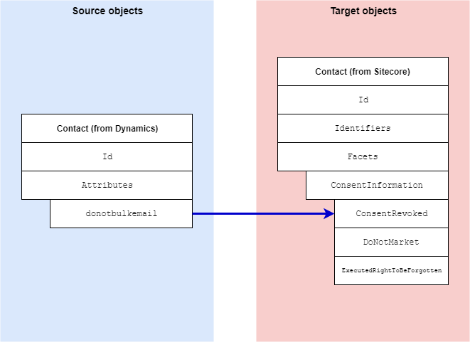

Consent Information Facet
===================================================
Dynamics tracks whether a contact has granted or revoked
consent to be contacted, usually for marketing purposes. 
This section describes how this consent is mapped to a 
contact in Sitecore.

.. contents:: In this topic:
   :local:

Format in Dynamics
-------------------------------------------------
In Dynamics, consent is associated with a contact 
through attributes on the contact. 

Format in Sitecore
-------------------------------------------------
In Sitecore, consent is associated with a contact 
through a contact facet:

.. |consent-info-facet-type| replace:: ``Sitecore.XConnect.Collection.Model.ConsentInformation``

+---------------------------+-------------------------------------------------+
| Facet Name                | ``ConsentInformation``                          |
+---------------------------+-------------------------------------------------+
| Facet Type                | |consent-info-facet-type|                       |
+---------------------------+-------------------------------------------------+

Mapping Values
-------------------------------------------------

.. |consent-info-source-object| replace:: Contact entity from Dynamics
.. |consent-info-mapping-location| replace:: **Dynamics to xConnect Contact Mappings > Dynamics Contact to xConnect Contact Consent Information Facet**

+---------------------------+-------------------------------------------------+
| Source objects            | |consent-info-source-object|                    |
+---------------------------+-------------------------------------------------+
| Target object             | |consent-info-facet-type|                       |
+---------------------------+-------------------------------------------------+
| Mapping definition        | |consent-info-mapping-location|                 |
+---------------------------+-------------------------------------------------+

