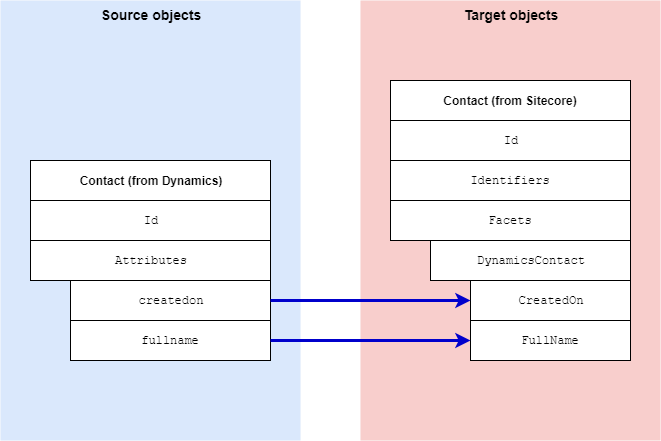

Dynamics Contact Information Facet
===================================================
This section describes how contact metadata from Dynamics 
is mapped to a contact in Sitecore.

.. contents:: In this topic:
   :local:

Format in Dynamics
-------------------------------------------------
In Dynamics, contact metadata is associated with a contact 
through attributes on the contact. 

Format in Sitecore
-------------------------------------------------
In Sitecore, contact metadata from Dynamics is associated 
with a contact through a contact facet:

.. |dynamics-contact-facet-type| replace:: ``Sitecore.DataExchange.Tools.DynamicsConnect.Facets.DynamicsContactInformation``

+---------------------------+-------------------------------------------------+
| Facet Name                | ``DynamicsContact``                             |
+---------------------------+-------------------------------------------------+
| Facet Type                | |dynamics-contact-facet-type|                   |
+---------------------------+-------------------------------------------------+

Mapping Values
-------------------------------------------------

.. |dynamics-contact-source-object| replace:: Contact entity from Dynamics
.. |dynamics-contact-mapping-location| replace:: **Dynamics to xConnect Contact Mappings > Dynamics Contact to xConnect Contact Dynamics Info Facet**

+---------------------------+-------------------------------------------------+
| Source objects            | |dynamics-contact-source-object|                |
+---------------------------+-------------------------------------------------+
| Target object             | |dynamics-contact-facet-type|                   |
+---------------------------+-------------------------------------------------+
| Mapping definition        | |dynamics-contact-mapping-location|             |
+---------------------------+-------------------------------------------------+

