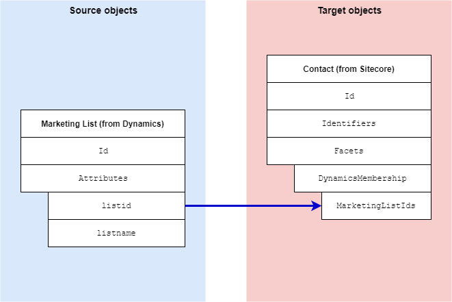

Dynamics List Membership Facet
===================================================
This section describes how marketing list membership 
information from Dynamics is mapped to a contact in 
Sitecore.

.. contents:: In this topic:
   :local:

Format in Dynamics
-------------------------------------------------
Dynamics supports static and dynamic marketing lists.
The way a contact is associated with a marketing list
depends on which of these types the marketing list is:

    * **Static marketing lists** - a separate entity 
      is used to associate the contact with the 
      marketing list. Basically it is an entity 
      with two properties: the marketing list id 
      and the contact id.
    * **Dynamic marketing lists** - membership is 
      determined at runtime using a search query.

Format in Sitecore
-------------------------------------------------
In Sitecore, contact metadata from Dynamics is associated 
with a contact through a contact facet:

.. |dynamics-membership-facet-type| replace:: ``Sitecore.DataExchange.Tools.DynamicsConnect.Facets.DynamicsMembership``

+---------------------------+-------------------------------------------------+
| Facet Name                | ``DynamicsMembership``                          |
+---------------------------+-------------------------------------------------+
| Facet Type                | |dynamics-membership-facet-type|                |
+---------------------------+-------------------------------------------------+

Mapping Values
-------------------------------------------------
The data synchronization process determines the contacts
in Dynamics that are associated with a marketing list. 
Then, information that identifies each marketing list 
is set on the contact in Sitecore.

.. note::

    The data mapping process is complex due to the way 
    marketing list membership is read from Dynamics, and
    a need to read data from Dynamics as efficiently as
    possible.

    The description below is a very simplified 
    representation of the mapping process. Fortunately,
    it is unlikely you will need to customize this
    mapping process.

.. |dynamics-membership-source-object| replace:: Contact entity from Dynamics
.. |dynamics-membership-mapping-location| replace:: **Staging Database to xConnect Contact Mappings > Add Dynamics Memberships to xConnect Contact Membership Facet**

+---------------------------+-------------------------------------------------+
| Source objects            | |dynamics-membership-source-object|             |
+---------------------------+-------------------------------------------------+
| Target object             | |dynamics-membership-facet-type|                |
+---------------------------+-------------------------------------------------+
| Mapping definition        | |dynamics-membership-mapping-location|          |
+---------------------------+-------------------------------------------------+

