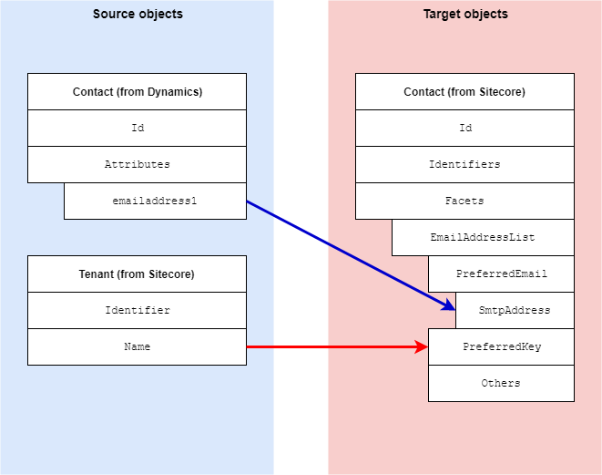

Emails Facet
===================================================
This section describes how email address information is
mapped from a contact in Dynamics to a contact in Sitecore.

.. contents:: In this topic:
   :local:

Format in Dynamics
-------------------------------------------------
In Dynamics, email addresses are associated with a 
contact through attributes on the contact. 

Format in Sitecore
-------------------------------------------------
In Sitecore, email addresses are associated with a 
contact through a contact facet:

.. |emails-facet-type| replace:: ``Sitecore.XConnect.Collection.Model.EmailAddressList``

+---------------------------+-------------------------------------------------+
| Facet Name                | ``Emails``                                      |
+---------------------------+-------------------------------------------------+
| Facet Type                | |emails-facet-type|                             |
+---------------------------+-------------------------------------------------+

Mapping Values
-------------------------------------------------
The contact facet provides the ability to store multiple 
email addresses. The standard mappings only handle a single
email address, which is set as the preferred email address 
on the contact facet.

.. |emails-source-objects| raw:: html

    Contact entity from Dynamics,
    Tenant from Sitecore

.. |emails-mapping-location| replace:: **Dynamics to xConnect Contact Mappings > Dynamics Contact to xConnect Contact Emails Facet**

+---------------------------+-------------------------------------------------+
| Source objects            | |emails-source-objects|                         |
+---------------------------+-------------------------------------------------+
| Target object             | |emails-facet-type|                             |
+---------------------------+-------------------------------------------------+
| Mapping definition        | |emails-mapping-location|                       |
+---------------------------+-------------------------------------------------+

