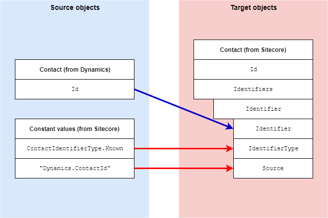

Contact Identifier
=================================================
In Dynamics, a contact is uniquely identified by
its entity id. This section describes how this value
is mapped from a contact in Dynamics to a contact 
identifier in Sitecore.

.. contents:: In this topic:
   :local:

Format in Dynamics
-------------------------------------------------
In Dynamics, contact identification information is 
associated with a contact through attributes on the 
contact. 

Format in Sitecore
-------------------------------------------------
In Sitecore, identifiers are associated with a 
contact through contact identifiers.

Mapping Values
-------------------------------------------------
A contact can have multiple identifiers associated with
it. The standard mappings only handle a single identifier.

.. |identifier-source-objects| raw:: html

    Contact entity from Dynamics,
    Constant values from Sitecore

.. |identifier-type| replace:: ``Sitecore.XConnect.ContactIdentifier``
.. |identifier-mapping-location| replace:: **Dynamics to xConnect Contact Mappings > Dynamics Contact Identifier to xConnect Contact Identifier Constructor**

+---------------------------+-------------------------------------------------+
| Source objects            | |identifier-source-objects|                     |
+---------------------------+-------------------------------------------------+
| Target object             | |identifier-type|                               |
+---------------------------+-------------------------------------------------+
| Mapping definition        | |identifier-mapping-location|                   |
+---------------------------+-------------------------------------------------+

