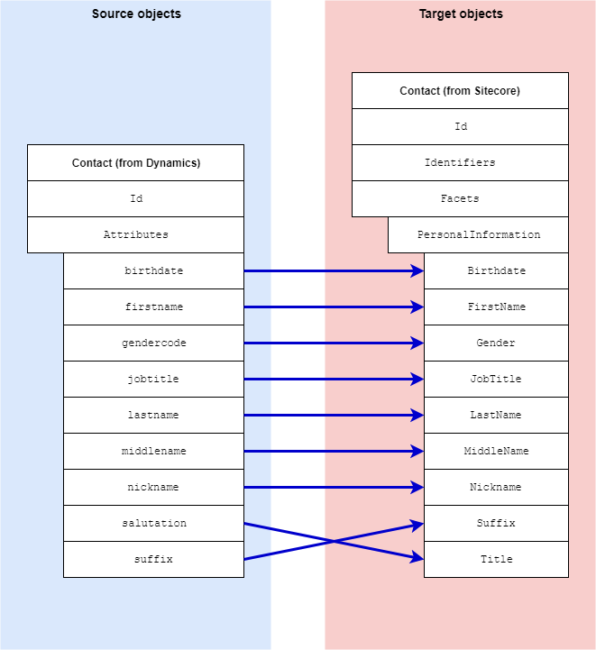

Personal Facet
===================================================
This section describes how personal information is
mapped from a contact in Dynamics to a contact in Sitecore.

.. contents:: In this topic:
   :local:

Format in Dynamics
-------------------------------------------------
In Dynamics, personal information is associated with 
a contact through attributes on the contact. 

Format in Sitecore
-------------------------------------------------
In Sitecore, personal information is associated with a contact 
through a contact facet:

.. |personal-facet-type| replace:: ``Sitecore.XConnect.Collection.Model.PersonalInformation``

+---------------------------+-------------------------------------------------+
| Facet Name                | ``Personal``                                    |
+---------------------------+-------------------------------------------------+
| Facet Type                | |personal-facet-type|                           |
+---------------------------+-------------------------------------------------+

Mapping Values
-------------------------------------------------

.. |personal-source-object| replace:: Contact entity from Dynamics
.. |personal-mapping-location| replace:: **Dynamics to xConnect Contact Mappings > Dynamics Contact to xConnect Contact Personal Info Facet**

+---------------------------+-------------------------------------------------+
| Source objects            | |personal-source-object|                        |
+---------------------------+-------------------------------------------------+
| Target object             | |personal-facet-type|                           |
+---------------------------+-------------------------------------------------+
| Mapping definition        | |personal-mapping-location|                     |
+---------------------------+-------------------------------------------------+

