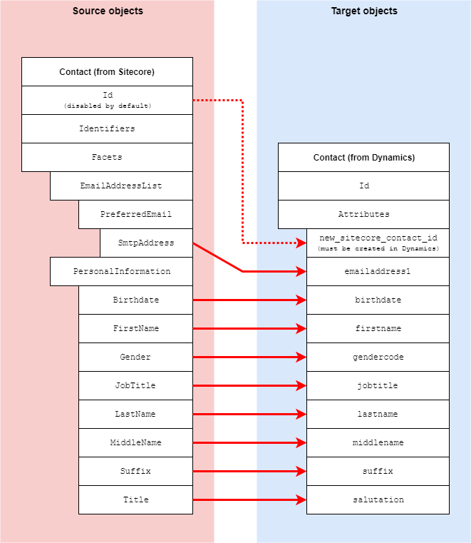

Contacts
=================================================
This section describes how contact information is
mapped from a contact in Sitecore to a contact in Dynamics.

.. contents:: In this topic:
   :local:

Format in Sitecore
-------------------------------------------------
In Sitecore, information is associated with a contact 
through contact facets.

Format in Dynamics
-------------------------------------------------
In Dynamics, information is associated with a contact 
through attributes on the contact. 

Mapping Values
-------------------------------------------------

.. |contact-mapping-location| replace:: **xConnect Contact to Dynamics Contact Mappings > Contact Model to Dynamics Contact**

+---------------------------+-------------------------------------------------+
| Source objects            | Contact from Sitecore                           |
+---------------------------+-------------------------------------------------+
| Target object             | Contact entity from Dynamics                    |
+---------------------------+-------------------------------------------------+
| Mapping definition        | |contact-mapping-location|                      |
+---------------------------+-------------------------------------------------+

