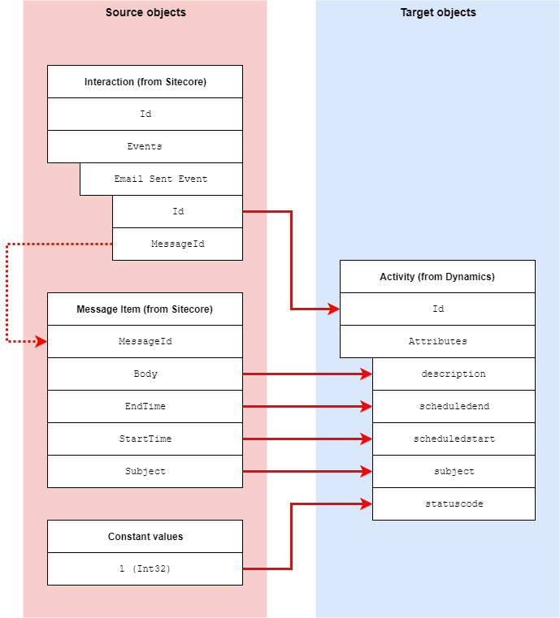

Email Activity
=================================================
When Sitecore Email Experience Manager (EXM) is used 
to send an email message to a contact, an interaction 
is created for the contact, and an email message event 
is added to that interaction.

This email message event is mapped to an activity in Dynamics.

.. contents:: In this topic:
   :local:

Format in Sitecore
-------------------------------------------------
In Sitecore, information is associated with an event
through properties on the event.

Format in Dynamics
-------------------------------------------------
In Dynamics, information is associated with an activity 
through attributes on the activity. 

Mapping Values
-------------------------------------------------

.. |email-activity-mapping-location| replace:: **xConnect Event to Dynamics Activity Mappings > xConnect EXM Message Item to Dynamics Email Activity**

+---------------------------+-------------------------------------------------+
| Source objects            | Email Sent Event from Sitecore,                 |
|                           | Message Item from Sitecore,                     |
|                           | Constant values                                 |
+---------------------------+-------------------------------------------------+
| Target object             | Activity entity from Dynamics                   |
+---------------------------+-------------------------------------------------+
| Mapping definition        | |email-activity-mapping-location|               |
+---------------------------+-------------------------------------------------+

